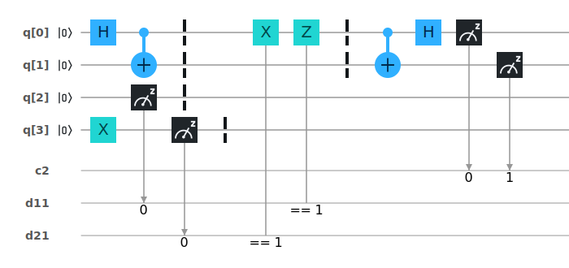

# Superdense Coding

Superdense coding is a phenomena where two classical bits can be transferred from one place to another by only transferring one entangled qubit.

The script is in the following file: [superdense_coding.qasm](./superdense_coding.qasm)

The circuit looks like the following: 

